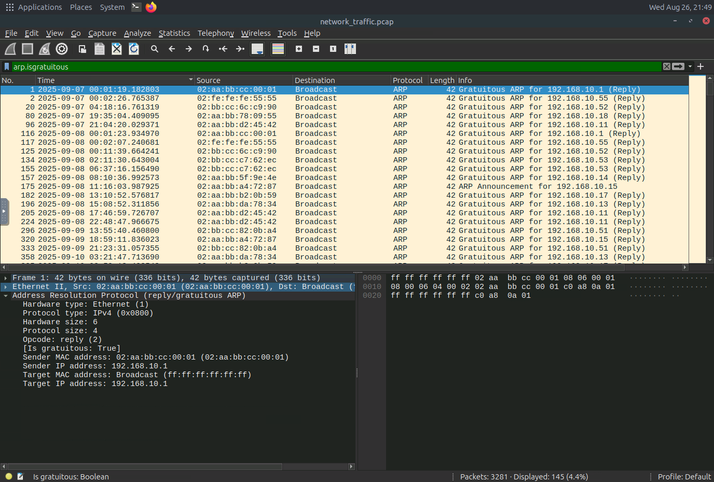
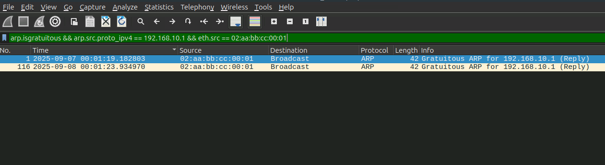
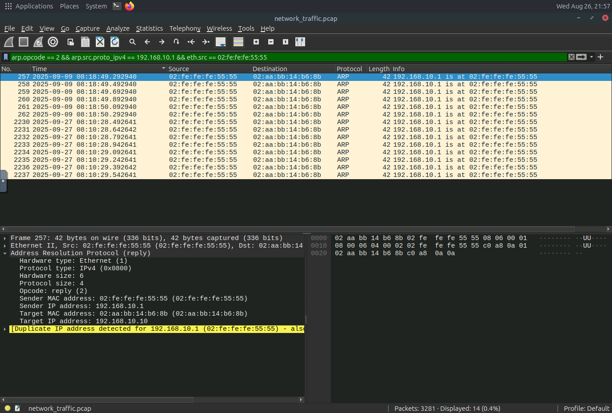
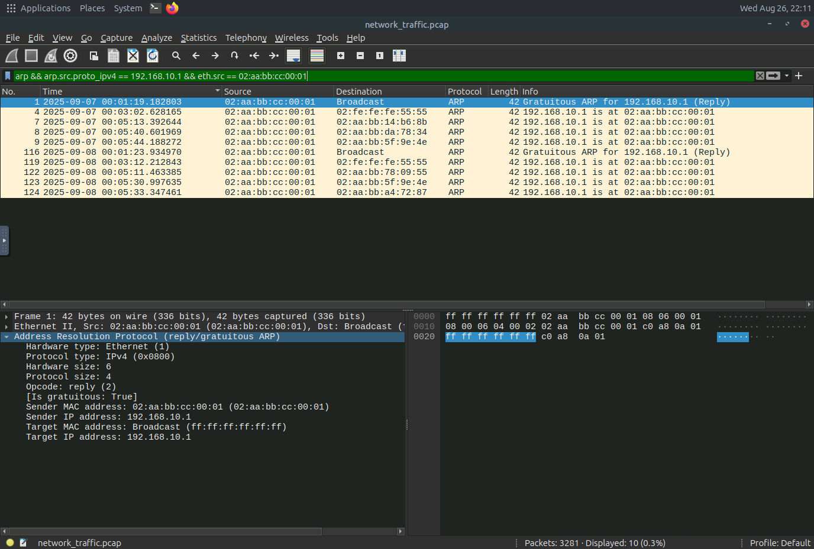
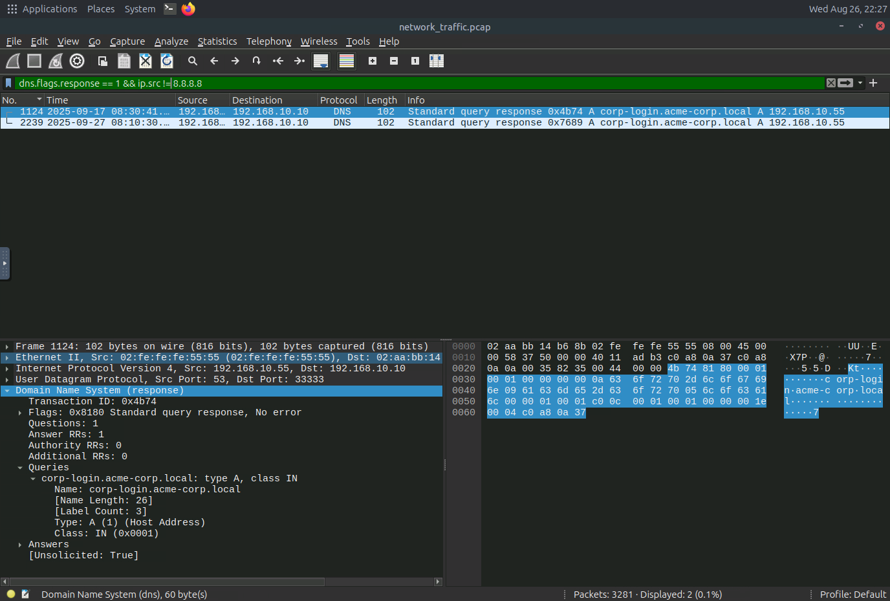
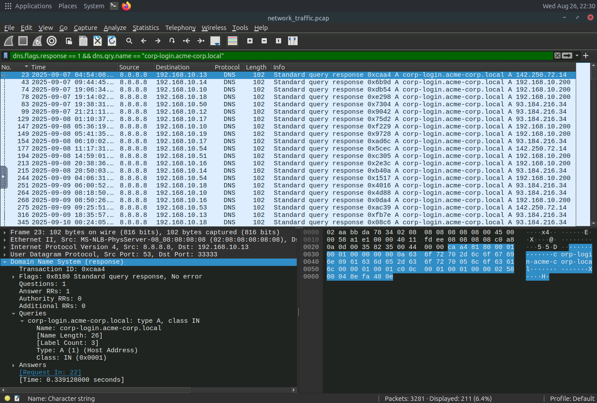
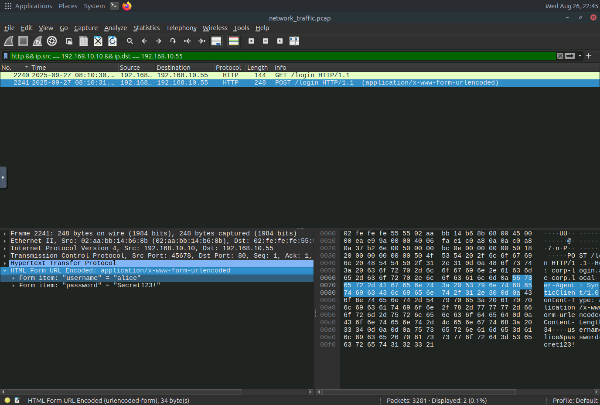
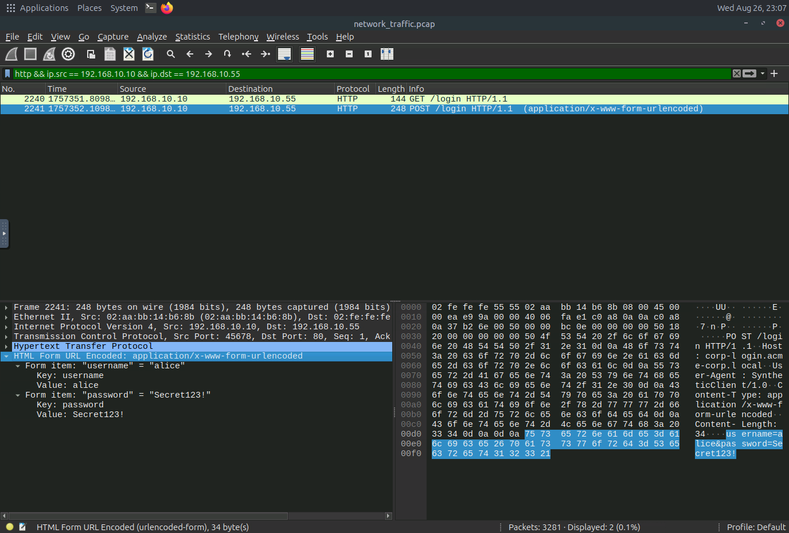

# Man-in-the-Middle Detection — TryHackMe Write-up

**Room:** Man-in-the-Middle Detection
**Focus:** Network traffic analysis (Wireshark), ARP spoofing, DNS spoofing, SSL stripping, MITM attack-chain correlation

> This write-up documents the investigation and findings from the room in my own words. The screenshots are from my own lab work.

## Investigation Overview

A routine network-monitoring alert at Acme Corp flagged unusual traffic patterns consistent with a Man-in-the-Middle attack inside the corporate LAN. Working from the supplied `network-traffic.pcap` (3,281 packets) in Wireshark, I traced a three-stage attack chain — **ARP spoofing** for interception, **DNS spoofing** for redirection, and **SSL stripping** for credential capture — from the attacker's first forged ARP reply through to the victim's plaintext login.

### Network Roles (established during the investigation)

| Role | IP | MAC | Notes |
|---|---|---|---|
| Gateway | 192.168.10.1 | `02:aa:bb:cc:00:01` | Legitimate router |
| Attacker | 192.168.10.55 | `02:fe:fe:fe:55:55` | Poisons ARP, spoofs DNS, strips SSL |
| Victim | 192.168.10.10 | `02:aa:bb:14:b6:8b` | Targeted host |
| Target domain | `corp-login.acme-corp.local` | — | Legitimately resolves to `93.184.216.34` / `142.250.72.14`; spoofed to `192.168.10.55` |

## 1. Establish the Network Baseline

Before hunting for spoofing, I first looked at what *normal* ARP traffic looks like, using:

```text
arp.isgratuitous
```

This returned 145 of the 3,281 packets in the capture — gratuitous ARP replies from many different hosts announcing their own IP-to-MAC mapping, which is routine on a LAN.

I then narrowed the filter to the known gateway IP and its real MAC address:

```text
arp && arp.src.proto_ipv4 == 192.168.10.1 && eth.src == 02:aa:bb:cc:00:01
```

This returned exactly **10 packets** — a mix of normal `is-at` replies to specific hosts and two gratuitous self-announcements roughly 24 hours apart (`2025-09-07 00:01:19` and `2025-09-08 00:01:23`), which is a typical router keep-alive pattern. Every one of these packets carries the same MAC, `02:aa:bb:cc:00:01`, confirming it as the gateway's genuine address.




### Key findings

| Finding | Result |
|---|---|
| Legitimate gateway MAC | `02:aa:bb:cc:00:01` |
| ARP packets observed from the gateway MAC | 10 |
| Gratuitous ARP replies observed for 192.168.10.1 | 2 |

## 2. Detect ARP Spoofing (Gateway Impersonation)

With the legitimate MAC confirmed, I searched for any other host claiming to be `192.168.10.1`:

```text
arp.opcode == 2 && arp.src.proto_ipv4 == 192.168.10.1 && eth.src == 02:fe:fe:fe:55:55
```

This returned **14 packets**, all reading `192.168.10.1 is at 02:fe:fe:fe:55:55`, sent in two bursts (`2025-09-09 08:18:49–50` and `2025-09-27 08:10:28–29`). Unlike the legitimate gateway's broadcasts, every one of these replies was sent **directly** to a single host, `02:aa:bb:14:b6:8b` (192.168.10.10) — the victim — rather than to the whole broadcast domain. That targeted, unsolicited pattern is the signature of active ARP cache poisoning rather than routine self-announcement.



### Key finding

| Finding | Result |
|---|---|
| MAC used by the attacker to impersonate the gateway | `02:fe:fe:fe:55:55` |
| ARP spoofing packets observed in total from the attacker | 14 |

## 3. Confirm the Poisoned Mapping

Wireshark flags conflicting ARP claims automatically, so I confirmed the spoof with its built-in expert filter:

```text
arp.duplicate-address-detected || arp.duplicate-address-frame
```

This returned the same 14 frames, each annotated by Wireshark: *"Duplicate IP address detected for 192.168.10.1 (02:fe:fe:fe:55:55) — also in use by 02:aa:bb:cc:00:01."* Across the entire capture, exactly **two** unique MAC addresses ever claim ownership of `192.168.10.1`: the real gateway and the attacker.



### Key finding

| Finding | Result |
|---|---|
| Unique MAC addresses claiming 192.168.10.1 | 2 (`02:aa:bb:cc:00:01` legitimate, `02:fe:fe:fe:55:55` attacker) |

## 4. Detect DNS Spoofing

With ARP poisoning confirmed, the next step was checking whether the attacker used that position to tamper with DNS. As a baseline, filtering on the domain of interest:

```text
dns.flags.response == 1 && dns.qry.name == "corp-login.acme-corp.local"
```

showed **211 responses**, almost all sourced from the legitimate resolver `8.8.8.8`. Widening the view to all DNS responses in the capture with `dns.flags.response == 1` and scanning for anything not coming from that resolver turned up one response sourced from `192.168.10.55` instead — answering `corp-login.acme-corp.local` with `192.168.10.55` itself and flagged `[Unsolicited: True]`.



### Key finding

| Finding | Result |
|---|---|
| DNS responses observed for `corp-login.acme-corp.local` | 211 |

## 5. Isolate the Forged Responses

Filtering specifically for responses not coming from the real resolver:

```text
dns.flags.response == 1 && ip.src != 8.8.8.8
```

isolated exactly **2 forged responses** (`2025-09-17 08:30:41` and `2025-09-27 08:10:30`), both sent from `192.168.10.55` — the same host and Ethernet MAC (`02:fe:fe:fe:55:55`) already identified in the ARP spoofing — and both answering `corp-login.acme-corp.local` with the attacker's own IP.



### Key findings

| Finding | Result |
|---|---|
| Forged DNS responses (source ≠ 8.8.8.8) | 2 |
| IP returned by the attacker's forged response | `192.168.10.55` |

## 6. Confirm the Domain Normally Uses TLS

Before concluding SSL stripping took place, I confirmed the login page is HTTPS-only under normal conditions:

```text
tls || ssl
```

This showed **64 packets** of legitimate `Client Hello` / `Server Hello` pairs with SNI `corp-login.acme-corp.local`, exchanged with the real server IPs (`93.184.216.34`, `142.250.72.14`) across many dates — establishing the encrypted baseline that the attack later bypasses.



## 7. Uncover SSL Stripping and the Captured Credentials

Finally, isolating traffic from the victim directly to the attacker's IP:

```text
http && ip.src == 192.168.10.10 && ip.dst == 192.168.10.55
```

returned 2 packets: a `GET /login HTTP/1.1` followed by a `POST /login HTTP/1.1`, both **plaintext HTTP on port 80** rather than a TLS session to the real server. The POST body (`application/x-www-form-urlencoded`) contained the victim's credentials in the clear:

```text
username=alice
password=Secret123!
```

Only one POST request to the domain appears anywhere in the capture.



### Key findings

| Finding | Result |
|---|---|
| POST requests observed for `corp-login.acme-corp.local` | 1 |
| Victim's captured username | `alice` |
| Victim's captured password | `Secret123!` |

## 8. Correlating the Full Attack Chain

Lining up the timestamps from every stage shows the three techniques were not independent events but one coordinated sequence:

| Time (approx.) | Event |
|---|---|
| 2025-09-09 08:18:49–50 | First ARP-spoof burst (6 packets) |
| 2025-09-17 08:30:41 | First forged DNS response |
| 2025-09-27 08:10:28–29 | Second ARP-spoof burst (8 packets) |
| 2025-09-27 08:10:30 | Second forged DNS response |
| 2025-09-27 08:10:30–31 | Victim sends `GET` then `POST /login` to the attacker over plain HTTP |

The final four events on 2025-09-27 all land within roughly three seconds of each other: the attacker re-poisons the victim's ARP cache, answers the victim's DNS lookup for the login domain with its own IP, and immediately receives the victim's plaintext credentials. That tight timing is strong evidence the ARP poisoning, DNS spoofing, and SSL stripping were executed together as a single successful run against this victim, with the earlier (Sept 9 / Sept 17) events representing an initial, less conclusive attempt.

## 9. Final Findings

| Category | Finding |
|---|---|
| Legitimate gateway MAC | `02:aa:bb:cc:00:01` |
| ARP packets from the gateway MAC | 10 |
| Gratuitous ARP replies for 192.168.10.1 | 2 |
| Attacker MAC impersonating the gateway | `02:fe:fe:fe:55:55` |
| ARP spoofing packets from the attacker | 14 |
| Unique MACs claiming 192.168.10.1 | 2 |
| DNS responses for `corp-login.acme-corp.local` | 211 |
| Forged DNS responses (source ≠ 8.8.8.8) | 2 |
| IP returned by the forged DNS response | `192.168.10.55` |
| Legitimate TLS handshakes observed for the domain | 64 |
| POST requests to the domain | 1 |
| Victim credentials captured | `alice` / `Secret123!` |

## 10. What I Learned

- Establish the legitimate baseline (real gateway MAC, normal DNS answers, normal TLS behavior) before hunting for spoofing — anomalies are only obvious in contrast.
- Gratuitous ARP is normal on its own; the tell is an *unsolicited, targeted* reply that contradicts an already-known mapping.
- Wireshark's built-in `arp.duplicate-address-detected` filter is a fast, reliable way to confirm ARP cache poisoning instead of eyeballing MAC addresses.
- DNS spoofing shows up as a second, conflicting answer to the same query from a source that isn't the configured resolver.
- Confirming a domain's normal TLS usage first makes it easy to prove SSL stripping: the disappearance of TLS handshakes, replaced by plaintext HTTP, is the evidence.
- Correlating timestamps across independent protocols (ARP, DNS, HTTP) turns three separate findings into one coherent attack narrative.

## Skills Demonstrated

- Network traffic analysis with Wireshark display filters
- ARP spoofing / cache-poisoning detection
- DNS spoofing / forged-response detection
- SSL stripping and cleartext credential-capture analysis
- Cross-protocol timeline correlation for incident reconstruction
