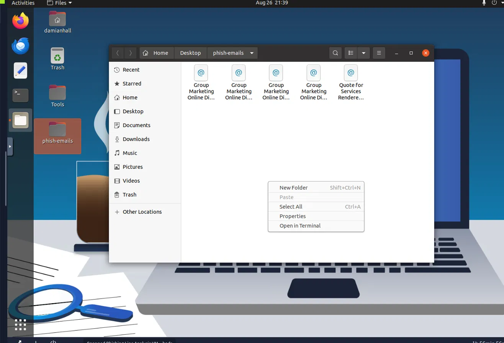
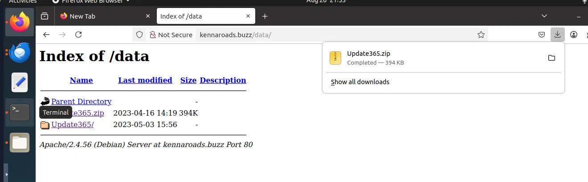
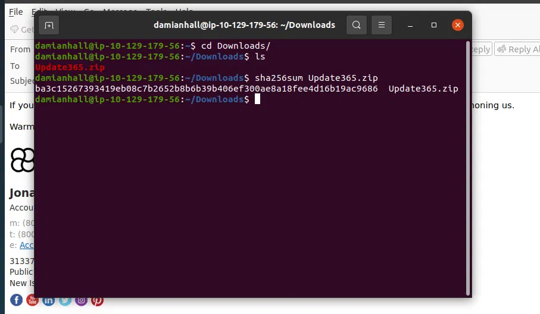
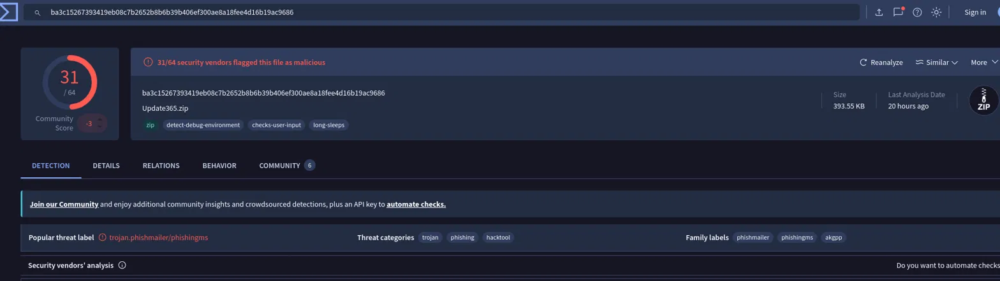
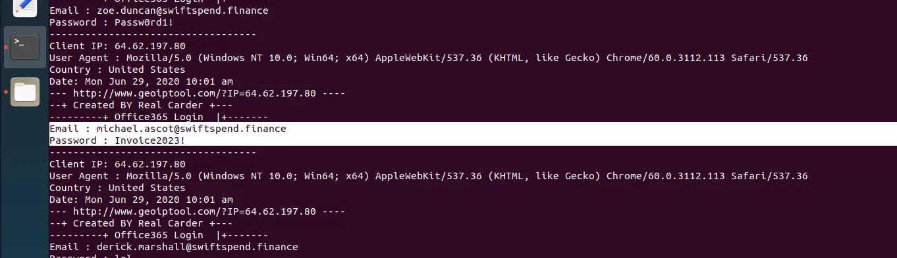
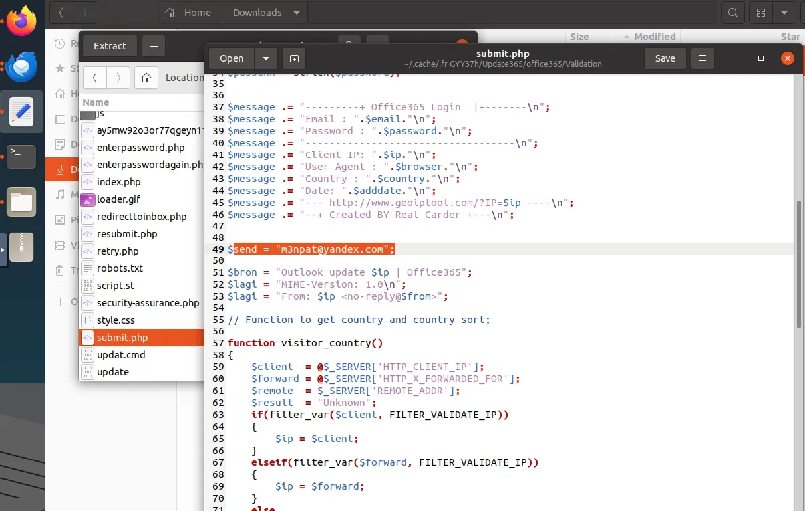
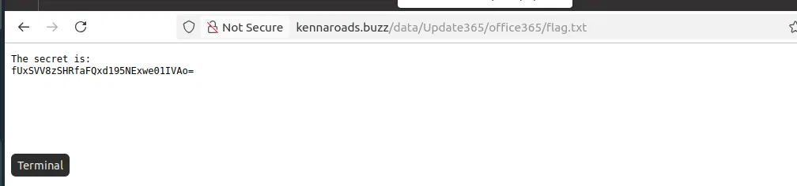
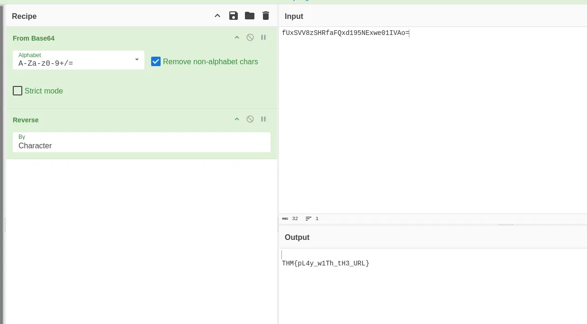

# Snapped Phish-ing Line — TryHackMe Write-up

**Room:** Snapped Phish-ing Line  
**Focus:** Phishing investigation, malicious URL analysis, exposed infrastructure, threat intelligence, and phishing-kit analysis

> This write-up documents the investigation and findings from the room in my own words. The screenshots are from my own lab work.

## Investigation Overview

Several employees at SwiftSpend Financial received suspicious emails, and some had already submitted their credentials to a malicious login page. The investigation followed the phishing chain from the original emails to the redirect domain, exposed web directory, phishing kit, captured credentials, and finally the hidden flag.

## 1. Review the Phishing Emails

The first step was reviewing the messages in the `phish-emails` folder.

There were five emails. Four used a very similar subject line, while one used the subject **"Quote for Services Rendered"** and was addressed to **William McClean**.

The phishing messages were sent from:

`Accounts.Payable@groupmarketingonline.icu`

The sender domain is unrelated to SwiftSpend Financial, which is an immediate indicator that the messages are not legitimate internal mail.



### Key findings

| Finding | Result |
|---|---|
| Recipient of "Quote for Services Rendered" | William McClean |
| Sender used by the attacker | Accounts.Payable@groupmarketingonline.icu |

## 2. Follow the Redirect to the Login Page

The email addressed to Zoe Duncan contained an attachment. Opening the attachment led to a fake Microsoft sign-in page.

The page was visually designed to look like a Microsoft login, but the important evidence was the domain in the address bar.

The root domain was:

`kennaroads.buzz`

That domain has no legitimate relationship with Microsoft and was the first major confirmation that the login page was part of the phishing infrastructure.

> The screenshot for this specific Microsoft login page was not included in the files supplied for this package, so I have not fabricated or substituted one.

### Key finding

| Finding | Result |
|---|---|
| Impersonated company | Microsoft |
| Root domain | kennaroads.buzz |

## 3. Discover the Exposed `/data/` Directory

Instead of stopping at the login page, the investigation checked what else was publicly accessible on the same host.

Browsing to:

`https://kennaroads.buzz/data/`

returned an open directory listing.



The directory exposed the phishing-kit archive:

`Update365.zip`

This was a significant operational mistake by the attacker because the same infrastructure used to host the phishing page also exposed the toolkit used behind it.

### Key finding

| Finding | Result |
|---|---|
| Exposed archive | Update365.zip |

## 4. Hash the Phishing Kit

Before extracting or interacting with the archive, I generated its SHA256 hash:

```text
ba3c15267393419eb08c7b2652b8b6b39b406ef300ae8a18fee4d16b19ac9686
```



Hashing the file first gives us a stable identifier that can be checked against threat-intelligence sources without executing the archive.

### Key finding

| Finding | Result |
|---|---|
| SHA256 | ba3c15267393419eb08c7b2652b8b6b39b406ef300ae8a18fee4d16b19ac9686 |

## 5. Check the Hash with VirusTotal

The hash was searched in VirusTotal.



The sample was flagged by **31 of 64 security vendors**.

In addition to phishing-related classifications, VirusTotal also associated the archive with the **Trojan** category. The page also showed the tags:

- `detect-debug-environment`
- `checks-user-input`
- `long-sleeps`

The archive contained **49 files**.

### Key findings

| Finding | Result |
|---|---|
| Vendors detecting the sample | 31 / 64 |
| Additional threat category | Trojan |
| Files in the archive | 49 |

## 6. Investigate the Captured Credentials

The exposed infrastructure also contained a log recording submissions made through the fake login page.



The log recorded information such as:

- victim email address
- submitted password
- client IP
- user agent
- country
- submission date/time

One account appeared more than once:

`michael.ascot@swiftspend.finance`

Repeated submissions are useful from an incident-response perspective because they indicate an account that may require particular attention during containment.

### Key finding

| Finding | Result |
|---|---|
| Repeatedly submitted email | michael.ascot@swiftspend.finance |

## 7. Read the Phishing Kit Source

After extracting the archive, the important file was:

`submit.php`



The script builds a message containing the victim's submitted information and sends it to a hardcoded external address.

The collection address was:

`m3npat@yandex.com`

This is the clearest indicator in the source code of where the stolen credentials were being sent.

### Key finding

| Finding | Result |
|---|---|
| Credential collection address | m3npat@yandex.com |

## 8. Recover the Exposed Flag

The same exposed infrastructure contained:

`flag.txt`



The file content was encoded. I used CyberChef with:

1. **From Base64**
2. **Reverse (Character)**



The decoded value was:

```text
THM{pL4y_w1Th_tH3_URL}
```

## 9. Final Findings

| Category | Finding |
|---|---|
| Phishing sender | Accounts.Payable@groupmarketingonline.icu |
| Recipient of "Quote for Services Rendered" | William McClean |
| Impersonated brand | Microsoft |
| Malicious root domain | kennaroads.buzz |
| Exposed archive | Update365.zip |
| SHA256 | ba3c15267393419eb08c7b2652b8b6b39b406ef300ae8a18fee4d16b19ac9686 |
| VirusTotal detection | 31 / 64 |
| Additional threat category | Trojan |
| Files in archive | 49 |
| Repeated credential submission | michael.ascot@swiftspend.finance |
| Credential collection address | m3npat@yandex.com |
| Decoded flag | `THM{pL4y_w1Th_tH3_URL}` |

## 10. What I Learned

- Inspect the sender and domain before trusting the visual appearance of a message or login page.
- Treat the address bar as a primary phishing indicator.
- Check the rest of the infrastructure, not just the landing page.
- Hash suspicious files before extracting or executing them.
- Use threat-intelligence platforms such as VirusTotal to enrich file investigations.
- Review exposed directories for related artifacts such as archives, logs, or source code.
- Reading phishing-kit source code can reveal the attacker's credential-collection destination.
- Encoded artifacts can contain additional indicators or flags and may require multi-step decoding.

## Skills Demonstrated

- Email artifact and sender analysis
- URL and redirect investigation
- File hashing and threat-intelligence lookup
- Open web-directory investigation
- Malicious PHP source-code analysis
- Credential-log analysis
- CyberChef decoding
- Phishing infrastructure analysis

## Flag

```text
THM{pL4y_w1Th_tH3_URL}
```
