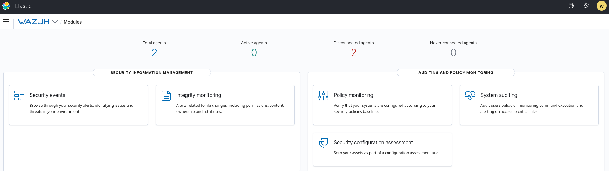
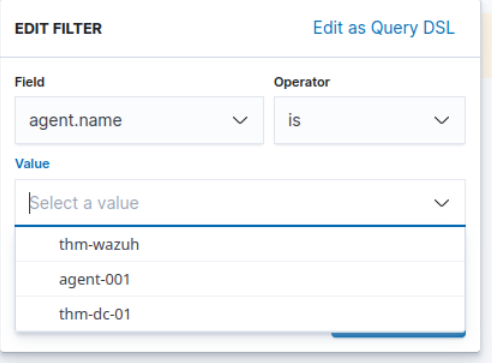
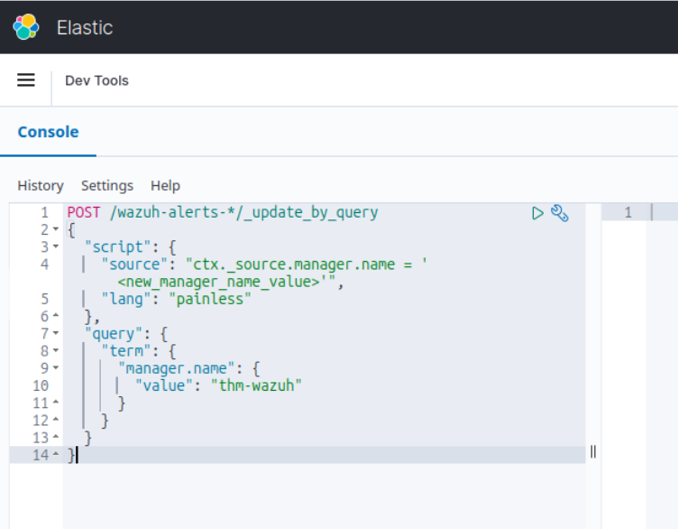
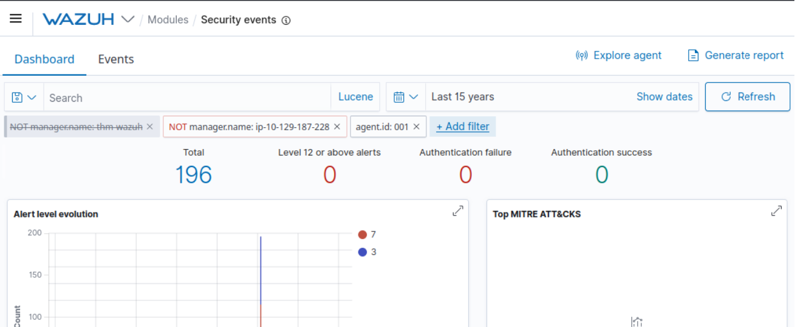
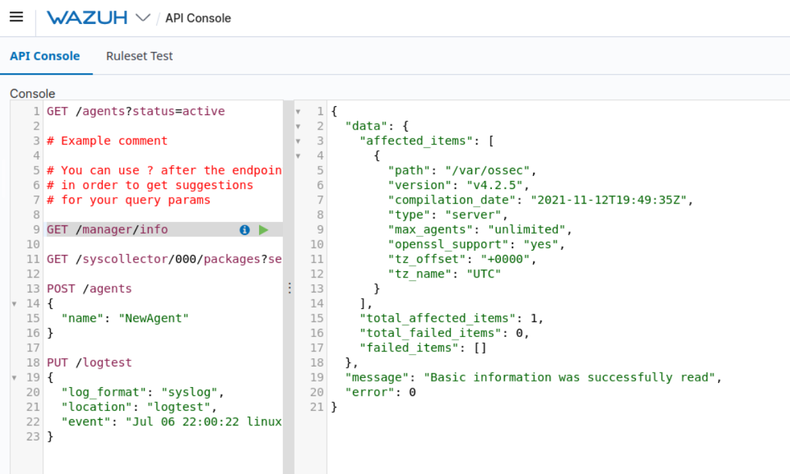

# Wazuh Security Monitoring — TryHackMe Write-up

**Room:** Wazuh
**Focus:** SIEM/XDR platform tour — agent architecture, vulnerability detection, SCA/compliance, Windows Sysmon & Linux auditd log collection, Wazuh REST API

> This room is a guided platform tour rather than an exploitation challenge — the "investigation" here is navigating and interpreting Wazuh's own modules. Screenshots are from my own instance.

## Platform Overview

Wazuh is a free, open-source unified security platform (released 2015) combining EDR, SIEM, and cloud-security monitoring in one tool. It runs on a **manager/agent** model: a central **manager** stores, correlates, and analyzes data (rule matching, CVE lookups, compliance scoring), while lightweight **agents** installed on endpoints ship logs and telemetry back to it.

## 1. Agent Deployment & Status

The provided management server manages **2 agents** (`agent-001`, `thm-dc-01`), both showing as **Disconnected** at the time of review. Agents are normally added via *Wazuh → Agents → Deploy New Agent*, a wizard that generates an OS-specific install command once you supply the manager's address and (optionally) a group.



## 2. Vulnerability Detection & Compliance (SCA)

The **Vulnerability Detection** module periodically inventories each agent's installed software (via syscollector) and cross-references it against known CVEs — e.g. flagging an outdated Vim build against CVE-2019-12735. **Security Configuration Assessment (SCA)** separately benchmarks an agent's configuration against frameworks like MITRE ATT&CK, NIST, and PCI DSS, scoring compliance and surfacing hardening gaps.

## 3. Security Events — Agent-001

Filtering *Security Events* down to `agent-001` (excluding noise from the manager's own hostname) returned **196 alerts**. The `agent.name` field wasn't populating correctly for filtering on this instance — a known issue with the lab's sample data — so I worked around it with a direct Elasticsearch `_update_by_query` in Dev Tools to normalize the `manager.name` field before re-filtering.





## 4. Log Collection — Windows & Linux

- **Windows/Sysmon:** Sysmon (installed separately) records detailed process, network, and registry activity to the Windows Event Log. Pointing the Wazuh agent's `ossec.conf` at the `Microsoft-Windows-Sysmon/Operational` channel (`<localfile>` / `eventchannel`) ships those events to the manager, where a custom local rule can flag specific behavior (e.g. PowerShell execution).
- **Linux/auditd:** `auditd` monitors Linux system calls and writes them to `/var/log/audit/audit.log` per rules in `/etc/audit/rules.d/audit.rules` (e.g. logging every `execve` run as root). The Wazuh agent tails that log via a `<localfile>` entry with `log_format: audit`.
- Wazuh ships ~900 out-of-the-box rulesets (`/var/ossec/ruleset/rules`) for common services (Apache, Docker, FTP, MongoDB, etc.), so most standard application logs need no custom rule at all.

## 5. Wazuh REST API

The manager exposes a REST API (port 55000), authenticated via a bearer token, usable from `curl` or the built-in API Console (*Wazuh → Tools → API Console*). Confirmed the manager version directly through the console:

```
GET /manager/info
```



`GET` retrieves information; `PUT`/`POST` perform actions (e.g. registering an agent, running a log test).

## Key Findings

| Item | Result |
|---|---|
| Wazuh released | 2015 |
| Monitored endpoint term | Agent |
| Central controller term | Manager |
| Agents managed | 2 (`agent-001`, `thm-dc-01`) |
| Agent status | Disconnected |
| Security Events — agent-001 | 196 |
| Sysmon events land in | Windows Event Viewer |
| Linux audit tool | auditd |
| Auditd rules file | `/etc/audit/rules.d/audit.rules` |
| Default Wazuh ruleset path | `/var/ossec/ruleset/rules` |
| Manager version (via API) | v4.2.5 |

## What I Learned

- The manager/agent split is what lets Wazuh centralize correlation and CVE/compliance scoring instead of leaving it to each endpoint.
- Out-of-the-box SCA rules are noisy by design — routine OS maintenance alone can generate hundreds of "security events" — so tuning local rules matters as much as enabling the module.
- Lab data isn't always clean (e.g. an unpopulated filter field); being able to fix it directly through the underlying Elasticsearch API rather than getting stuck is a useful skill on its own.
- Log ingestion follows the same pattern regardless of source (Sysmon, auditd, Apache): point a `<localfile>` block at the log/channel, match it to a ruleset, restart the agent.

## Skills Demonstrated

- SIEM navigation and alert triage (Wazuh dashboard)
- Vulnerability management & compliance scoring (SCA, CVE correlation)
- Log source onboarding — Windows Sysmon and Linux auditd
- REST API interaction (curl / bearer auth / API Console)
- Basic Elasticsearch query/update troubleshooting
